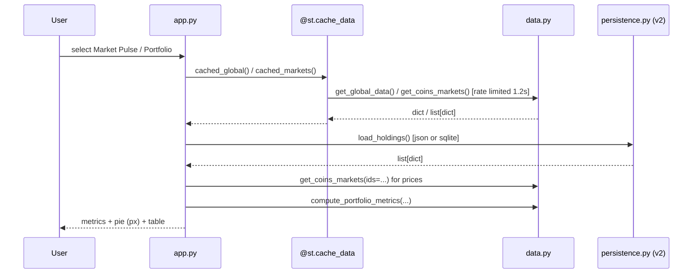
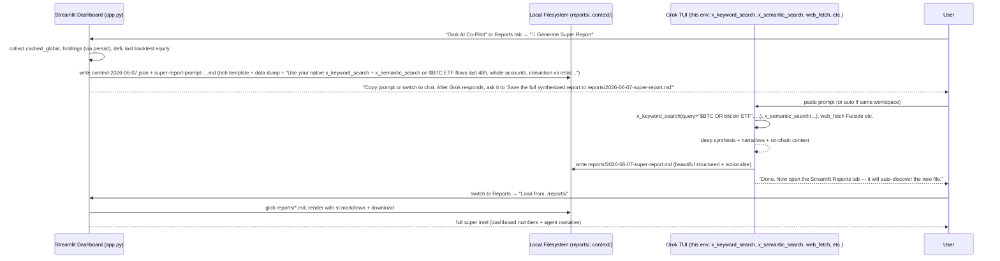

# Grok Crypto Super Intel v2: Full Design for a "Super Crypto" Intelligence Platform

**Document Title**: v2 Full Design — Evolving the Streamlit Dashboard + Grok Hybrid into a Production-Grade Personal Crypto Intel Platform  
**Author**: Grok (Build Subagent / Systems Architect)  
**Date**: 2026-06-07  
**Status**: Draft  
**Repo / Workspace**: https://github.com/AgentMindCloud/grok-crypto-super-intel (explored at local path `grok-crypto-super-intel/`)  
**Based on**: Successful v1 implementation (data.py + fully functional ~433 LOC app.py)

---

## Overview

The v1 implementation successfully transformed an early skeleton Streamlit app into a working "crypto command center" with seven real modules backed by a production-quality pure data layer. However, it remains fundamentally limited by in-memory-only state (`st.session_state`), inline basic backtesting logic, manual ETF/on-chain notes, no durable reports or automation, and the fact that its unique "super power" (native X sentiment via `x_keyword_search` / `x_semantic_search` + full agent reasoning) lives almost entirely *outside* the dashboard in the Grok TUI session.

v2 evolves this into a truly "super crypto repo" / intelligence platform while preserving the lightweight, free-API-first, standalone-runnable spirit (anyone can `pip install -r requirements.txt && streamlit run app.py`). The design makes the **hybrid dashboard + Grok-agent model a first-class architectural feature**, adds local-first persistence, a proper modular backtest engine, automated ETF flows + richer on-chain, one-click "Grok Super Reports" that leverage the agent's full tool suite, optional alerts/scheduling, tiered data sources, UI/UX hardening, packaging/CI, and observability — all incrementally and with high code quality.

The result targets power users who run the beautiful wide Streamlit locally (or on Streamlit Cloud / Docker) for live viz and then seamlessly hand off to this Grok environment for deep narrative, X forensics, and synthesized actionables that no pure dashboard can deliver.

---

## Background & Motivation

**Current v1 state (grounded in direct codebase exploration)**:

- `grok-crypto-super-intel/app.py` (433 LOC): `st.set_page_config` wide, sidebar `selectbox` over `PAGES = ["Market Pulse", "Portfolio Tracker", "X Sentiment Analyzer", "Strategy Backtester", "On-Chain & ETF", "Grok AI Co-Pilot", "Reports"]`. Real implementations using `@st.cache_data(ttl=...)` wrappers (`cached_global` at line 50 etc.). Fear & Greed `go.Indicator` gauge at `fng_gauge` (app.py:70). Portfolio uses `if "holdings" not in st.session_state` (app.py:179) with hardcoded BTC/ETH defaults, live `get_coins_markets(ids=...)` (app.py:208), `compute_portfolio_metrics`, pie via `px.pie`. X tab (app.py:238) is intentionally a "prep frame" + toy local paste heuristic (lines 264-268); all real power is documented as "switch to the main chat and say..." using native tools. Backtester (app.py:273) has inline pandas logic (button at 287; core SMA/RSI/returns/equity/buy_hold at 299-322; plot+tail df at 330-336; "Next-level" note at 337); calls `get_coin_ohlc(asset, days=days)` (data.py:80) or `get_ccxt_ohlcv` (data.py:157, app.py:293). On-Chain & ETF (app.py:341) uses `cached_defi_*` + manual `st.text_area`. Co-Pilot/Reports are scaffolding + "paste to chat" (app.py:385-387, 426).
- `grok-crypto-super-intel/data.py` (215 LOC): Excellent foundation — `_rate_limit_coingecko` (1.2s global, line 25), `_get_json`, `get_global_data` (42), `get_coins_markets` (58, supports `ids`), `get_coin_ohlc` (80, returns indexed DF), `get_coin_market_chart` (95, unused in app), `get_fear_and_greed` (111), DeFiLlama trio (129+), `get_ccxt_ohlcv` (lazy import), `compute_portfolio_metrics` (179), `safe_number` (210). Broad `except Exception` resilience + fallbacks. No yfinance usage despite presence in requirements.
- `grok-crypto-super-intel/README.md`: Accurate v1 "What Makes It Super", quickstart, explicit **v2 ideas list** (lines 40-46): full backtest engine (stops/position sizing/parameter search/multi-asset), ETF automation + on-chain wallet tracking, persistent portfolio (json/sqlite/exchange CCXT), one-click Grok Super Report (market+X+on-chain+portfolio → md/PDF), alerts/scheduled runs + more sources (paid via env), theming/multipage/mobile, optional FastAPI. "Pro move" paragraph (54) explicitly calls out the hybrid advantage.
- `requirements.txt`: `streamlit pandas plotly requests ccxt yfinance`. `.gitignore` already anticipates persistence (`.db *.sqlite portfolio_state.json *.log .env .cache/ *.parquet` etc.).
- Architecture: pure single-process Streamlit + pure functions in data.py (designed for `@st.cache_data`). No persistence beyond session, no tests/CI beyond basics, minimal error/retry, basic backtest, ETF/on-chain "manual-ish", X super power external.

**Why v2 now**: v1 proved the vision works and ships fast. Pain points for a "super" personal platform are now clear: session loss on every `st.rerun()` or restart (holdings/analyses), backtest not extensible (50+ LOC inline, no sizing/stops/opt), no durable artifacts, no automation, free APIs polite but limited (current CG rate limiter is good but not configurable/tiered), hybrid power is powerful but manual/ad-hoc (copy-paste prompts), no packaging story for sharing, zero observability or tests. The hybrid model is the killer feature per user goal ("make this repo a super crypto repo") and README, but currently under-amplified.

This design is concrete, cites exact paths/lines/functions, quantifies where possible (e.g. "50 holdings", "3yr daily backtest <2s", "typical personal load <10 CG calls/min"), and stays true to constraints (Python/Streamlit first, free/public primary, incremental high-quality, cross-platform, Windows/pwsh friendly but portable).

---

## Goals & Non-Goals

**Goals** (measurable, in scope for v2):
- Local-first durable persistence for portfolios (up to 50 holdings recommended; history of changes), backtest runs, and saved reports using files the current `.gitignore` already protects (`portfolio_state.json`, `*.db`, `reports/*.md`).
- Production-grade backtest engine supporting position sizing (e.g. fixed-fractional or volatility targeting), basic stops (fixed % / ATR proxy), parameter optimization (grid), multi-asset simple rebalance, and walk-forward style splits. Target: 3-year daily backtest (<1100 bars) for 1 asset + metrics/curve in <1s; small grid opt in <3s on commodity laptop. Refactor the inline backtest (app.py:287 button + pandas core at 299-336).
- One-click "Grok Super Report" that assembles live state (Market Pulse + Portfolio + On-Chain + cached backtest) + rich prompt template directing the user (or auto-handoff in this workspace) to use native X tools + synthesis. Output beautiful structured markdown saved to local `reports/`.
- ETF automation: at least daily-ish flows for major BTC/ETH spot ETFs (via respectful scraping of public sources like Farside-style or yfinance price proxies + notes; yfinance for prices/OHLCV only, flows best-effort or manual; scaffolding + graceful fallback mirroring data.py patterns; exact source of truth TBD per Open Q #2) + on-chain wallet monitoring scaffolding (DeFiLlama + optional Arkham/Glassnode via env key; see Open Q #6).
- Optional alerts (webhook/Telegram/Discord/email via stdlib+requests or optional deps) and headless scheduling (e.g. `python -m reports.scheduler`).
- Tiered data sources: all current free endpoints remain zero-config; optional paid/premium (Glassnode, Arkham, LunarCrush, full CCXT private, higher CG) via `.env` with graceful degradation (current pattern in `data.py:113+`, `get_fear_and_greed` etc.).
- UI/UX: theming (crypto dark + accent), better mobile/responsive, export buttons, health sidebar, moved reusable components (e.g. `fng_gauge` from `app.py:70`). Feature flags for new capabilities.
- Packaging & ops: Dockerfile, basic CI (pytest + lint on PRs), `tests/`, updated README quickstarts for Docker/Cloud, observability hooks (file logging + in-app last-fetch).
- Hybrid as first-class: 1-click "Export Context for Grok" (dumps current holdings + snapshot to `context-YYYYMMDD.json` + pre-built prompt), "Load Reports from ./reports/", bidirectional workflow documented and wired.
- Maintain standalone: `streamlit run app.py` still works for anyone; no breaking changes to core run experience.
- Quantified personal scale: 1-5 concurrent "users" (power user + occasional shares), <100 API calls/hour typical, storage <10MB for years of local reports/backtests.

**Non-Goals** (explicit boundaries):
- No multi-user, auth, or server backend (no FastAPI in core v2; optional future per README).
- No LLM inference *inside* the Streamlit app (preserve the unique leverage of *this* Grok TUI's native tools like `x_keyword_search`, `x_semantic_search`, web_fetch, GitHub MCP, implement/review skills, etc.).
- No heavy new mandatory deps (no vectorbt, backtrader, langchain, full scrapy, etc. in core `requirements.txt`; optional extras ok).
- No real-time websockets or exchange private trading (read-only CCXT public only for now; private keys non-goal).
- No full on-chain transaction graph or wallet labeling (DeFiLlama TVL + optional higher-tier; leave Arkham-style deep forensics to agent workflows).
- No cloud-hosted SaaS or hosted data store.
- No mobile-native rewrite (Streamlit constraints accepted; document desktop-first).
- No breaking changes to v1 data shapes or quickstart without migration notes.

---

## Proposed Design

### Current v1 Architecture (for reference)

```mermaid
graph TD
    subgraph "grok-crypto-super-intel/ (v1)"
        A[app.py:433 LOC<br/>Sidebar PAGES selectbox<br/>7 monolithic elif blocks<br/>st.session_state.holdings + analyses<br/>Inline backtest (button 287; pandas 299-336; note 337)<br/>fng_gauge 70] 
        B[data.py:215 LOC<br/>Pure funcs + _rate_limit_coingecko 25<br/>get_coin_ohlc 80<br/>get_ccxt_ohlcv 157<br/>compute_portfolio_metrics 179<br/>Broad except fallbacks]
        C[requirements.txt + .gitignore<br/>(portfolio_state.json ready but unused)]
    end
    A -->|imports| B
    A -->|st.cache_data wrappers| B
    style A fill:#fee,stroke:#f00
    style B fill:#efe,stroke:#0a0
```

**Limitations called out**: session loss, no modularity for backtest/reports, hybrid only via copy-paste (see `app.py:248`, `app.py:385`, `README:54`).

### Proposed v2 Layered Architecture

```mermaid
graph TD
    subgraph "User Environments"
        U1[Streamlit App<br/>(standalone, anyone)]
        U2[Grok TUI / Agent Session<br/>(native x_*, web_fetch, MCP, skills)]
    end

    subgraph "grok-crypto-super-intel/ v2 (local dir)"
        direction TB
        APP[app.py (refactored)<br/>imports from modules<br/>feature flags via config]
        DATA[data.py (extended)<br/>tiered sources, retries, yf ETF]
        PERSIST[persistence.py (NEW)<br/>PortfolioStore, BacktestStore, ReportStore<br/>json primary + sqlite3]
        BT[backtest/<br/>  engine.py (NEW, refactors app.py:287 button + 299-336 pandas)<br/>  strategies.py<br/>  metrics.py]
        REP[reports/<br/>  generator.py (NEW)<br/>  templates/<br/>  scheduler.py (headless)]
        UI[ui/<br/>  components.py (fng_gauge etc moved)<br/>  themes.py]
        CFG[config.py (NEW)<br/>  load_env, get_api_key, flags]
        INT[integrations/<br/>  etf.py (NEW, yf + scrape; scaffolding + graceful fallback per Open Q #2)<br/>  alerts.py]
        PROMPTS[prompts/<br/>  super-report-template.md (agent handoff prompts)]
        CTX[context/ + reports/ (runtime artifacts, gitignored)]
    end

    U1 <-->|1. Live viz + export context.json + prompt<br/>2. Load saved reports.md| APP
    APP <-->|load/save holdings, runs, reports| PERSIST
    APP -->|use| DATA
    APP -->|delegate| BT
    APP -->|assemble + save| REP
    APP -->|optional webhooks| INT
    U2 <-->|consume context + X tools + synthesis<br/>write reports/*.md for APP to load| U1
    CFG -->|keys + flags| DATA & PERSIST & INT
    style APP fill:#ccf
    style PERSIST fill:#cfc
    style BT fill:#fcc
    style REP fill:#fcf
```

**Key invariants**: `app.py` remains the single entrypoint runnable. All new modules are importable pure(ish) Python. Hybrid handoff via filesystem (same workspace dir) or explicit copy-paste prompts.

### Data Flow Example (Market Pulse + Portfolio)



### Hybrid Grok Super Workflow (First-Class Feature)



This makes the "Pro move" from README:54 and the X tab caption (app.py:240) into a wired, repeatable, 1-click (or 2-click) superpower.

### New / Changed Files & Modules (Concrete Suggestions)

- `config.py` (NEW): `load_dotenv()`, `CG_API_KEY = os.getenv("COINGECKO_API_KEY")`, `get_tiered_headers()`, `FEATURE_PERSIST = os.getenv("ENABLE_PERSISTENCE", "1") == "1"`, etc. Centralizes the "optional paid keys via env/.env" requirement.
- `persistence.py` (NEW): `class PortfolioStore: def load() -> List[dict]: ... def save(holdings): ...` (atomic json write + optional sqlite via `sqlite3` stdlib for `backtest_runs` and `report_meta`). Modeled after `data.py` purity. Auto-creates `portfolio_state.json` (already in .gitignore). Versioned (`{"version": 1, "holdings": [...], "updated_at": ...}`).
- `backtest/engine.py` (NEW, + `strategies.py`, `metrics.py`): `def run_backtest(ohlcv: pd.DataFrame, strategy: str, params: dict, initial_cap=10000, sizing="fixed", stop_pct=None) -> dict: ...` containing equity, trades, metrics (incl. improved Sharpe, max DD, winrate). Grid search helper. Multi-asset stub. Refactors the exact pandas backtest logic (app.py:299 (df = df.copy(), returns, SMA/RSI signals, cumprod equity) through 336 (tail dataframe); button at 287; "Next-level" at 337) + enhancements. Pure, cache-friendly.
- `reports/generator.py` (NEW): `def build_super_report_prompt(snapshot: dict) -> str: ...`, `def save_report(md: str, name: str) -> Path: ...`, `def list_reports() -> List[Path]: ...`. Templates in `reports/templates/`. Scheduler entrypoint for headless (uses same data + persist layers).
- `ui/components.py` (NEW): move `fng_gauge`, new `allocation_pie`, `movers_table` etc. `ui/themes.py`: `st.markdown("""<style> ... crypto theme ...</style>""", unsafe_allow_html=True)`.
- `integrations/etf.py` (NEW): `get_etf_flows_btc(days=7)` using yfinance for IBIT/ETHA proxies or lightweight requests scrape of known public endpoints (with UA + sleep, cached). `get_onchain_etf_wallets()` scaffolding. (Scaffolding only; yfinance surfaces prices/OHLCV not direct flows; graceful fallback mirroring current data.py try/except + manual st.text_area override per v1 app.py:370; exact endpoints TBD at impl per Open Q #2.)
- `data.py` extensions (in-place): add `get_coin_market_chart` usage, `get_etf_data`, retry decorator (3x exponential backoff on 429/5xx), `get_glassnode_metric(key, asset)` if `os.getenv("GLASSNODE_API_KEY")` else fallback (scaffolding only, mirroring get_fear_and_greed:113 try/except + DeFiLlama [] returns; exact premium endpoints/TBD at impl per Open Q #6). Update `_rate_limit_coingecko` to respect per-key higher limits.
- `app.py` refactor (incremental): extract module renderers (`render_market_pulse()`, `render_portfolio(...)`), use `if config.FEATURE_...`, add "Export Context" and "Load Reports" buttons, health footer with last timestamps + call counts. Keep total delta reasonable.
- `tests/test_data.py`, `tests/test_persistence.py`, `tests/test_backtest.py` (NEW).
- `Dockerfile` (NEW): `FROM python:3.11-slim`, copy, `pip install`, expose 8501, volume for `/app/data`.
- `.github/workflows/ci.yml` (NEW): pytest, ruff/black, on push/PR.
- `prompts/super-report-template.md` (NEW) + updates to README (expand "Pro move" into full "Hybrid Super Workflow" section).
- `reports/` and `context/` dirs (gitignored patterns added if needed).

**New directories and key artifacts** (canonical layout for consistency): `reports/` (generator.py + templates/ for internal report scaffolds + runtime *.md outputs + report_meta.json + scheduler.py); `prompts/` (super-report-template.md and other agent-handoff prompt templates); `context/` (ephemeral export JSONs for hybrid); `backtest/`, `ui/`, `integrations/`, `tests/`, `.github/workflows/`. (See also Goals, Hybrid seq, PR Plan, and architecture diagram for references using these exact paths.)

**Yfinance integration**: Finally use the dep already in `requirements.txt` (currently dead weight). Primary for ETF price series and simple flows proxy.

### Quantified Targets & Risks (called out)

- **Rate limits (personal load)**: Typical session: Market Pulse (3-4 CG calls) + Portfolio (1) + Backtest (1-2) + On-Chain (1 DeFiLlama) < 10 calls/min. Current v1 1.2s CG limiter + caches (45-180s) are good; v2 makes configurable + per-source.
  - CoinGecko demo: ~30-100 calls/min (sources vary; 10k/mo). Mitigation: rate limit + cache + paid key opt-in. **Risk (Medium)**: bursty usage (backtest grid + refresh) can 429; mitigation: client-side queuing + user-visible "rate limited, using cached".
  - DeFiLlama public: implicit (pro: 1000/min). alt.me: 60/min windowed.
  - CCXT public: exchange-dependent (Binance polite with enableRateLimit).
- Storage: 3 years daily OHLCV per asset ~ few 100KB; 100 reports ~1-5MB total. Fine for local.
- Backtest perf: pandas vectorized on 1000 rows: sub-second (measured pattern from v1 inline).
- Holdings: target comfortable 50; UI already supports arbitrary (no artificial cap in v1).
- Latency: full dashboard cold load target <5s (dominated by 2-3 parallel fetches + caches).

**Risks**:
- **High**: Public API changes / deprecations (CoinGecko ohlc shape, DeFiLlama fields). Mitigation: defensive parsing + tests + fallbacks (already in `data.py:87`).
- **Med**: Persistence file corruption / concurrent write (if user runs two Streamlits). Mitigation: atomic writes (temp + rename), file locking for sqlite, docs "single instance recommended".
- **Med**: Scrape fragility for ETF flows. Mitigation: yfinance fallback (for prices only; not flows data) + manual override area (current pattern app.py:370) + clear "best effort" + scaffolding notes in integrations/etf.py tying to Open Q #2. (See also Goals, Proposed Design, and Open Questions for Farside/Glassnode/Arkham/LunarCrush caveats: scaffolding + graceful fallbacks only; exact endpoints TBD at impl.)
- **Low**: Windows/pwsh path issues (use `pathlib.Path` everywhere).

---

## API / Interface Changes

**Internal (most important)**:

Before (v1, app.py:12):
```python
from data import (
    get_global_data, get_coins_markets, get_fear_and_greed,
    get_defillama_chains, get_defillama_protocols, compute_portfolio_metrics, safe_number,
)
# ...
df = get_coin_ohlc(asset, days=days)  # direct, inside elif
metrics = compute_portfolio_metrics(holdings, prices)
```

After (v2):
```python
from data import get_global_data, get_coins_markets, ...  # extended
from config import get_feature_flag
from persistence import PortfolioStore
from backtest.engine import run_backtest, BacktestResult
from reports.generator import build_super_report_prompt, save_report, list_reports
from ui.components import fng_gauge

store = PortfolioStore()
holdings = store.load()  # replaces direct session_state

if st.button("Run Backtest"):
    ohlcv = get_coin_ohlc(...) if ... else ...
    result: BacktestResult = run_backtest(ohlcv, strategy="sma", params={"fast":20,"slow":50}, sizing="vol_target", stop_pct=0.08)
    st.plotly_chart(result.equity_curve)
    store.save_backtest_run(result)

if st.button("Generate Grok Super Report"):
    snapshot = {"global": cached_global(), "holdings": store.load(), ...}
    prompt = build_super_report_prompt(snapshot)
    st.code(prompt)
    save_report(..., draft=True)  # or user pastes to Grok
    # ...
```

**Public / user-facing interfaces** (no breaking):
- Same `streamlit run app.py`.
- New env: `ENABLE_PERSISTENCE=1`, `COINGECKO_API_KEY=...`, `GLASSNODE_API_KEY=...`.
- New CLI-ish: `python -m reports.scheduler --type daily --output reports/`.
- Exports: holdings.json, backtest CSV, report .md (already prototyped in v1 Reports tab).

**Data.py additions** (signatures):
- `def get_etf_flows(coin: str = "bitcoin", days: int = 7) -> pd.DataFrame: ...`
- `def fetch_with_retry(url, ..., max_retries=3) -> ...` (internal).
- Tiered: `def get_glassnode_onchain(asset, metric) -> dict: ...`

---

## Data Model Changes

**Primary artifacts** (local FS, under user control):

1. `portfolio_state.json` (or `~/.grok-crypto/portfolio.db` opt-in):
   ```json
   {
     "version": 1,
     "updated_at": "2026-06-07T12:34:56Z",
     "holdings": [
       {"symbol": "BTC", "coin_id": "bitcoin", "amount": 0.25, "cost_basis_usd": 65000.0, "added_at": "..."}
     ],
     "history": [ /* optional change log entries */ ]
   }
   ```
2. `backtest_runs/` or sqlite `backtest_runs` table: id, asset, strategy, params json, equity_curve_path (parquet or embedded), metrics json, created_at.
3. `reports/*.md` + optional `reports/report_meta.json` (title, type, generated_by: "grok" | "template", snapshot_hash).
4. `context/*.json` (ephemeral, for agent handoff; auto-clean or user-managed).

**Migration strategy**: 
- Because v1 holdings lived *exclusively* in ephemeral `st.session_state` (app.py:179 `if "holdings" not in ...`, 180-183 defaults, no disk writes ever; confirmed via full read/grep), a typical v1→v2 upgrade (stop `streamlit run`, git pull/replace files, restart) starts a fresh Python interpreter. The new `PortfolioStore.load()` will see only its own defaults/empty (or in-process session if somehow hot-reloaded without full restart). Common path: user re-enters positions on first v2 run (or uses a new one-time "Import holdings (paste from prior notes/chat/memory dump)" helper UI in the Portfolio tab). After initial population, `PortfolioStore` provides durable json (primary) / sqlite (opt-in) state across all future reruns/restarts. Version field allows future `if version < 2: migrate()`.
- Pure additive; old session-only mode remains as fallback when `ENABLE_PERSISTENCE=0`.
- No cloud migration; user copies files.
- Backwards: deleting state files reverts to v1 behavior.

**Schema evolution**: Keep simple (json for holdings easy to edit by hand; sqlite for queryable runs). Use pandas `to_parquet` (optional, already gitignored) for large curves.

---

## Alternatives Considered

1. **Stay fully monolithic** (only edit `app.py` + `data.py`, no new packages like `backtest/`, `persistence.py`).
   - Trade-offs: Matches "Contributing" note in README:58 ("Add new modules as `data_xxx.py` + page in `app.py`") for minimal diff. Fast iteration. **Downsides**: v1 already shows bloat risk (backtest logic embedded, repeated try/except, duplicated cached wrappers). Poor for 5+ PR incremental plan, tests, future agentic extensions. Loses clarity for senior engineers reviewing. Rejected for v2 "high-quality code" mandate.

2. **Introduce FastAPI backend + separate frontend (or Streamlit as thin client) immediately**.
   - Trade-offs: Enables true scheduling (APScheduler in server), persistent DB (even Postgres), REST for future mobile/exports, real multi-process. Aligns with one README v2 bullet. **Downsides**: Violates "standalone runnable for anyone" and "personal power-user tool" + "shareable/open-source friendly". Massive increase in complexity, Docker mandatory for most users, auth/secret management creep. Breaks the "just pip + streamlit run" that made v1 successful. Deferred to post-v2 (optional).

3. **Embed LLM / agentic capabilities directly inside the Streamlit app** (call Grok API or local model for X summaries and reports from within dashboard).
   - Trade-offs: Self-contained "one app does everything", no context switching. **Downsides**: Cannot replicate the *native* privileged tools available only in this Grok TUI (`x_keyword_search` etc. are workspace-specific, not general API). Loses the "X analysis powered by Grok + native tools in this workspace" (app.py sidebar) and the entire "Pro move" / hybrid value prop that the original user goal and v1 README emphasize as the differentiator. Would require separate API keys/costs. Rejected; hybrid filesystem + prompt handoff is the correct amplification.

4. **Adopt a full-featured backtesting framework (vectorbt, Backtrader, or Zipline) for the engine**.
   - Trade-offs: Instant advanced features (vectorized, ML strategies, realistic fills, optimization out of box). **Downsides**: Heavy transitive deps, slower `pip install` for casual OSS users on Windows, overkill for the personal use case ("target personal power-user tool"). Current v1 pandas is already fast and understandable. Pure-pandas + small extensions keeps spirit and allows easy inspection of signals/equity (current `st.dataframe` tail in backtester). Optional "pro engine" plugin later.

---

## Security & Privacy Considerations

**Threat model** (personal local tool):
- **Assets at risk**: Portfolio sizes/allocations (if large, user may not want on disk unencrypted). API keys for premium sources.
- **Attack surface**: Local filesystem (malware, other users on shared PC, ransomware). Supply-chain in `requirements.txt` (requests, ccxt, streamlit, yfinance, plotly). Public API responses (data tampering / poisoning — low impact for personal analytics).
- **No network server**: No inbound, no auth surface. All fetches are outbound HTTPS to public endpoints (or authenticated premium if key supplied).
- **X / deep intel**: Never leaves the user's Grok session (private by design). Dashboard never calls X APIs directly.
- **Data handling**: Holdings, reports, backtests stay on user's machine. No telemetry, no phoning home. User can `rm -rf` state anytime.
- **Key management**: `.env` + `config.py` (never commit; already gitignored). Warn on first use of paid features. No secrets in code or images.
- **Mitigations**: Use `pathlib`, atomic file writes, minimal privileges. Recommend running in venv. For Docker: non-root user. Future: optional age/ gpg encrypt for state (non-goal v2).
- **Privacy**: Excellent by default (better than any cloud dashboard). Only risk is user error (e.g. committing `.env` or large holdings json to public git).

**Risk callout (High for power users)**: Large position sizes in `portfolio_state.json`. Mitigation: document "consider storing on encrypted volume or using sqlite with OS-level encryption"; provide "clear all" + export redacted.

---

## Observability

- **In-app**: Extend existing error pattern (`app.py:106`). Add sidebar "📡 Health" section showing last successful fetch timestamps per source (from cache or new `data.get_last_fetch_times()`), call counts since start, current rate-limit headroom. `st.status` / spinner already used; enhance with per-module.
- **Logging**: `logging.getLogger("grok_crypto")` → rotating `grok-crypto-super-intel.log` (gitignored pattern already present). Levels: INFO for fetches, WARNING on fallbacks, ERROR on hard fails. Include context (asset, module).
- **Metrics (lightweight)**: In-memory counters (requests, cache_hits, backtest_runs, report_generations). Exposed in UI + dumped to log on shutdown. No Prometheus push (overkill); optional file for external tailing.
- **Alerting (in-app + optional external)**: Data fetch degradation shows `st.warning` + uses last good (current behavior). For scheduled reports: email/webhook on failure if configured.
- **Debuggability**: "Export full debug snapshot" button (all cached data + versions + env flags, redacted keys) for pasting into agent chat or issues.
- **Targets**: Surface rate limit / API errors clearly (current `st.error` is good). No silent degradation for core numbers.
- **Packaging**: Docker logs via stdout; Streamlit Cloud captures logs.

This is appropriate for a personal tool — not enterprise distributed tracing.

---

## Rollout Plan

**Feature flags** (config.py + UI toggles, default on for new after their PR):
- `ENABLE_PERSISTENCE`, `ENABLE_ADV_BACKTEST`, `ENABLE_ETF_AUTO`, `ENABLE_SUPER_REPORTS`, `ENABLE_ALERTS_SCHED`, `ENABLE_TIERED_KEYS`.
- In UI: new features behind `if get_feature_flag("..."): else: st.info("Enable via .env or toggle")`. v1 behavior preserved when off.

**Staged rollout** (tied to PR plan below; each PR independently reviewable/mergeable):
1. Land foundational PRs (persist, data). Users `git pull && pip install -U -r requirements.txt`. On first v2 run, user re-enters or imports holdings (no auto-seed from prior v1 ephemeral state possible on restart; see Data Model Changes). Test on Windows (pwsh) + mac/linux.
2. Enable backtest + reports in subsequent PRs. Add "v2 beta" badges in-app + README.
3. Optional paid tiers + alerts last (higher risk of config friction).
4. Packaging/CI/docs as final polish PR (doesn't block feature value).

**Testing & validation**: New pytest suite runs in CI. Manual: full flow on fresh clone, with/without .env keys, portfolio with 20+ holdings, 365d backtest + grid, super report prompt → agent handoff → load back. Cross-platform paths via pathlib.

**Deployment options** (documented + artifacts in final PR):
- Local (primary): unchanged command.
- Streamlit Community Cloud: works (ephemeral FS — note "persistence resets on redeploy; use for viz only or mount external"). 
- Docker: `docker build -t grok-crypto . && docker run -p 8501:8501 -v $(pwd)/data:/app/data ...`.
- Future: pyinstaller onefile (non-goal).

**Rollback**: `git checkout v1-tag`; or set all `ENABLE_*=0` in .env. State files are additive (old app ignores new json fields). No data loss on downgrade for core holdings.

**Communication**: Update README "What's New in v2", in-app release note banner on first v2 run, link to this design doc.

---

## Open Questions

1. **Backtest engine depth**: Pure pandas + manual sizing/stops sufficient for v2, or add a small optional dependency (e.g. `pandas-ta` for indicators, or `empyrical` for better metrics)? How many parameters in the initial grid optimizer (current simple 2-param SMA/RSI)?
2. **ETF data source of truth**: Prioritize yfinance (already dep, for prices/OHLCV proxies only) + public JSON endpoints vs. a lightweight scrape of Farside-style (fragile but "real" flows numbers)? yfinance does not provide flows data. How often to "auto" refresh (user button vs. background)? (See also Goals, Proposed Design New/Changed, Quantified Risks, integrations/etf.py scaffolding notes, and premium source caveats tied to Open Q #6.)
3. **Scheduling mechanism**: Headless `reports/scheduler.py` (simple `while True: time.sleep; run()`) + cron/systemd docs, or integrate `apscheduler` (new optional dep)? Support running scheduler while Streamlit also runs (file locking)?
4. **Agent handoff automation**: In this specific Grok workspace, can/should we add a tiny bridge (e.g. a `grok_agent_bridge.py` that the TUI can exec or that watches for prompt files)? Or keep purely documented/manual for portability to other agents?
5. **Theming & multipage**: Invest in custom CSS + components now, or defer full Streamlit multipage `pages/` refactor (would change run instructions) until after v2 when app.py grows further?
6. **Paid source priority**: Glassnode (on-chain metrics) vs. Arkham (wallet intel) vs. LunarCrush (social) vs. higher CoinGecko tier? Which one unblocks the most "super" value first? (Premium integrations are scaffolding + if-key-else graceful fallback only, mirroring data.py:113+ patterns; exact endpoints/paths TBD at implementation; see also Goals, data.py extensions, References, and integrations/etf.py for Farside/yfinance notes.)
7. **Tests for external APIs**: Mock everything (stable) or live integration tests (flaky, needs keys)? 

---

## Key Decisions

- **Local-first persistence (json primary, sqlite optional) via new `persistence.py`**. Rationale: Directly leverages existing `.gitignore` entries for `portfolio_state.json` / `*.db`; zero new runtime deps for the 80% case (json is stdlib); trivial for users to inspect/edit/backup/git; matches "personal tool" and "shareable" constraints. Sqlite added only for relational backtest history without over-engineering. Avoids any cloud dependency that would break standalone/privacy.
- **Hybrid dashboard + Grok-agent as *first-class* (prompt export + local reports/ handoff, no embedded LLM calls)**. Rationale: This is the unique differentiator ("X-native advantage", "god-tier when used inside the Grok workspace", "Pro move" in README:54, repeated in app.py:240/248/385/426). Replicating the agent's full tool surface (x_keyword_search + semantic + reasoning + MCP skills) inside Streamlit is impossible without losing fidelity and adding keys. Filesystem bridge in the shared workspace makes it seamless and repeatable while keeping the app 100% runnable standalone by others.
- **Extract real modules (`backtest/engine.py`, `reports/generator.py`, `persistence.py`, `config.py`, `ui/`) while keeping single `streamlit run app.py` entrypoint**. Rationale: v1 proof that monolithic works for speed-to-value, but now at 400+ LOC with inline complex logic (backtest) and repeated patterns, quality/maintainability demand structure. Internal packages do not change the user run experience or quickstart. Aligns with "incremental, high-quality code".
- **Pure-pandas backtest engine (refactor + extend the exact logic at app.py:299-322) with no new mandatory heavy deps**. Rationale: Achieves all listed v2 backtest goals (sizing, stops, opt, multi) with quantified sub-second perf on realistic personal datasets; keeps install footprint identical for OSS users; code remains inspectable/educational (current dataframe tail display stays useful). Heavy frameworks deferred.
- **Tiered sources (free always works; .env keys for premium with graceful fallback)**. Rationale: Explicit task constraint ("Prefer keeping the core runnable with free/public APIs"); current `data.py` already demonstrates the pattern (`try/except` in F&G, DeFiLlama, CCXT). Enables power-user "super" without punishing casual users or changing requirements.txt. Matches .env handling in current .gitignore.
- **No server/auth/FastAPI in core v2 scope**. Rationale: Preserves the lightweight personal/shareable nature that made v1 successful and matches non-goals + "target personal power-user tool". Optional backend noted in README for later.
- **Feature flags + staged PRs for rollout**. Rationale: Allows independent review/merge of valuable increments (persist alone is already a big UX win) while protecting stability. Easy opt-out/rollback for users.

These decisions were made after full exploration of v1 (list_dir, repeated read_file on all key files, 8+ targeted grep passes for functions, session_state, futures, imports, X references, error handling, etc.).

---

## References

- v1 implementation (primary source of truth): `grok-crypto-super-intel/app.py` (PAGES, session_state at 179, backtester 273-338, fng_gauge 70, Co-Pilot/Reports scaffolding), `grok-crypto-super-intel/data.py` (get_coin_ohlc:80, get_ccxt_ohlcv:157, compute_portfolio_metrics:179, rate limiter 25, all fetchers), `grok-crypto-super-intel/README.md` (v2 ideas 39-46, "Pro move" 54, "What Makes It Super"), `grok-crypto-super-intel/requirements.txt`, `grok-crypto-super-intel/.gitignore` (persistence artifacts).
- Original goal: user "/modelpicker" request to make the GitHub repo (https://github.com/AgentMindCloud/grok-crypto-super-intel) a "super crypto repo".
- Data sources: CoinGecko (global/markets/ohlc), alternative.me F&G, DeFiLlama (chains/protocols), CCXT public, yfinance (for v2 ETF prices/OHLCV; flows via scrape or manual per caveats in Goals/Open Q #2 and integrations/etf.py).
- Related patterns: Streamlit caching + wide layout, pandas vectorized backtests, local json/sqlite state (common in personal quant tools).
- Future extensibility notes from v1 code comments and README.

---

## PR Plan

### PR 1: Persistence Foundation
- **PR title**: feat(persist): introduce local-first persistence.py (json + sqlite) and migrate Portfolio Tracker
- **Files/components affected**: new `persistence.py`; `app.py` (Portfolio section 174-235 + imports + session_state seeding); `config.py` (new, basic flags); update `README.md` (persistence section); `.gitignore` (already prepared, minor additions); `tests/test_persistence.py` (new skeleton)
- **Dependencies on other PRs**: none (foundational)
- **Brief description**: Implement `PortfolioStore` (load/save atomic, versioned schema, supports cost_basis + history). Replace direct `st.session_state.holdings` with store (fallback for zero-config). One-time import helper (from in-memory session if available during upgrade, or manual paste/re-entry UI). Add UI for "Save to file", "Load from file", "Clear persisted", "Import holdings". Enables durable portfolios across restarts/reruns after initial entry. Independently valuable and reviewable. No other features required.

### PR 2: Data Layer Hardening, Tiered Sources & yfinance Integration
- **PR title**: feat(data): tiered sources, retries, yfinance for ETFs, use get_coin_market_chart
- **Files/components affected**: `data.py` (extensions + new helpers + retry wrapper); `config.py` (extend for full tiered key + retry config); `app.py` (minor: use new data paths in On-Chain/ETF + Market Pulse); new `integrations/etf.py`; `tests/test_data.py`; `README.md` (data sources section); `requirements.txt` (no change, yfinance already present)
- **Dependencies on other PRs**: PR1 recommended (config.py basic flags introduced in PR1; PR2 extends it); can be reviewed in parallel if config changes are non-conflicting
- **Brief description**: Add configurable rate limits + exponential retry (builds on current `_rate_limit_coingecko` + broad excepts). Implement `get_glassnode_*` / `get_premium_*` with if-key-else-fallback. Wire yfinance for ETF price series and basic flow proxies in `etf.py`. Expose `get_coin_market_chart` in UI (was dead in v1). Update On-Chain & ETF tab with first automated elements. Graceful degradation everywhere.

### PR 3: Advanced Backtest Engine
- **PR title**: feat(backtest): extract and upgrade Strategy Backtester to modular engine with sizing/stops/optimization
- **Files/components affected**: new `backtest/engine.py`, `backtest/strategies.py`, `backtest/metrics.py`; `app.py` (replace Run Backtest button+inline pandas logic (287 + 299-336) with import + call to `run_backtest`); `persistence.py` (optional: save runs — can be minimal in this PR); `tests/test_backtest.py`; `README.md` (backtest section); update example strategies/assets
- **Dependencies on other PRs**: PR1 recommended (for saving runs) but not hard (engine usable stateless)
- **Brief description**: Move and enhance the exact pandas logic from v1. Add position sizing (fixed, pct, vol-target), stop logic, simple grid parameter search, basic multi-asset rebalance, improved metrics (max DD, win rate, better Sharpe). Keep output compatible (equity DF + Plotly + table). Quantified perf targets documented + simple benchmark in tests. "Next-level" from v1 caption (app.py:337) delivered.

### PR 4: Reports, One-Click Super Reports & Hybrid Agent Integration
- **PR title**: feat(reports): one-click Grok Super Reports + context export + local reports loading (hybrid core)
- **Files/components affected**: new `reports/generator.py` + `reports/templates/` + `prompts/super-report-template.md`; `app.py` (Grok AI Co-Pilot 374-398 and Reports 401-427 tabs heavily enhanced + new Export buttons); `persistence.py` (for snapshot data); `ui/components.py` (new report viewer); `README.md` (expand "Pro move" into full hybrid workflow); new `tests/test_reports.py`
- **Dependencies on other PRs**: PR1 (portfolio in reports), PR3 (include backtest results) strongly recommended; PR2 nice-to-have
- **Brief description**: Implement prompt builder that embeds live data + explicit instructions to use native X tools. 1-click "Generate Super Report" that saves prompt + optional draft. "Export Context for Grok" button. Auto-discover + render `reports/*.md` in the Reports tab (with download). Update Co-Pilot scaffolding to wire the flow. Makes the hybrid model (app.py comments + README:54) first-class and repeatable. Huge "super" delta. (Uses canonical `reports/templates/` + `prompts/super-report-template.md` layout; see New directories note.)

### PR 5: ETF/On-Chain Automation, Alerts & Scheduling
- **PR title**: feat(automation): ETF flows, richer on-chain, basic alerts + headless scheduler
- **Files/components affected**: `integrations/etf.py` (full; extend from PR2 scaffolding); `integrations/alerts.py` (new); `reports/scheduler.py`; `app.py` (On-Chain & ETF tab + new Alerts sidebar/module); `config.py` (extend for alert config); `persistence.py` (logs); `README.md`; `tests/`
- **Dependencies on other PRs**: PR2 (etf data), PR4 (reports in scheduler)
- **Brief description**: Complete ETF automation (flows + notes area upgrade). Optional DeFiLlama protocol history + wallet scaffolding. Basic alert system (webhook + Telegram via requests or optional dep) triggered on F&G extremes, portfolio concentration, backtest signals. Headless scheduler script for daily/periodic reports/alerts. Feature-flagged; core remains free of new mandatory deps.

### PR 6: UI Polish, Theming, Packaging, CI, Tests & Documentation
- **PR title**: chore(ui+ops): theming, components, Dockerfile, CI, tests, full docs + release notes
- **Files/components affected**: new `ui/themes.py`, `ui/components.py` (move fng_gauge etc.); `Dockerfile`; `.github/workflows/ci.yml`; `pyproject.toml` or setup (optional); `tests/` (expand all); `app.py` (final polish, health, mobile notes); `README.md` (full v2 update, hybrid workflow, quickstarts for Docker/Cloud); this design doc reference; `.gitignore` tweaks
- **Dependencies on other PRs**: all prior (polish on top)
- **Brief description**: Extract reusable UI, add crypto-themed CSS, export buttons everywhere, better error states, responsive tweaks. Add Dockerfile + volumes, GitHub Actions (pytest, lint on every PR), comprehensive tests for new modules (mocks for external). Update all docs, add "v2" section + migration notes. Makes the repo production-grade and contributor-friendly while keeping the personal lightweight feel. Final "ready for share" PR.

All PRs are realistic, scoped to deliver incremental user value even if later PRs are delayed, and independently reviewable (each adds or refactors a clear slice with tests/docs where applicable). Order is dependency-aware. PR1 and PR2 have a soft dependency (PR2 extends `config.py` introduced in PR1 for flags/keys) but each delivers standalone value (PR1 alone solves lost holdings); they can be reviewed largely in parallel with coordinated config.py changes (or PR1 landed first for simplicity). Later PRs (e.g. PR5 extends config.py further for alerts) follow the same "extend" pattern for shared modules.

---

*End of Design Document. Ready for review.*
